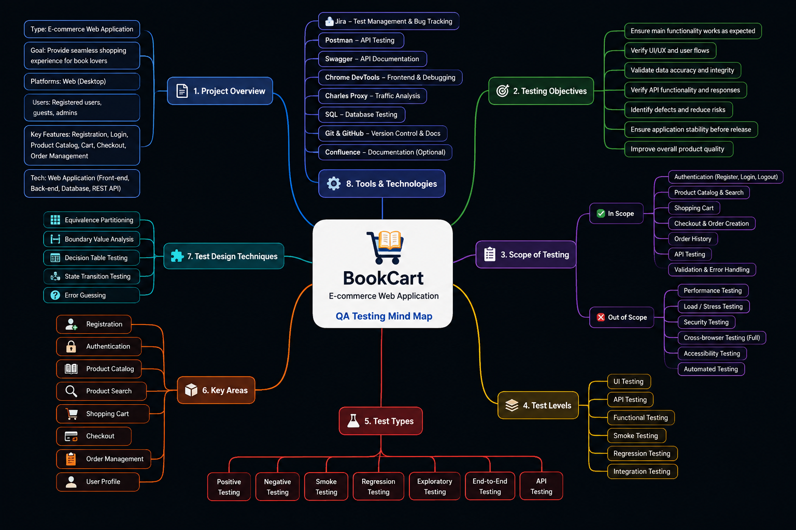

# QA Mind Map

## Project

**BookCart — E-commerce Web Application**

This mind map provides a structured overview of the application, testing scope, key functional areas, test types, testing techniques, tools, and QA objectives.

## Project Overview

- Application: BookCart
- Type: E-commerce Web Application
- Platform: Web (Desktop)
- Users: Registered users and administrators
- Main functionality:
  - Registration
  - Authentication
  - Product Catalog
  - Product Search
  - Shopping Cart
  - Checkout
  - Order Management

## Testing Scope

### In Scope

- Authentication
- Registration
- Product Catalog
- Product Search
- Shopping Cart
- Checkout and Order Creation
- Order History
- API Testing
- Validation and Error Handling

### Out of Scope

- Performance Testing
- Load and Stress Testing
- Security Testing
- Cross-browser Testing
- Accessibility Testing
- Automated Testing

## Test Levels

- UI Testing
- API Testing
- Functional Testing
- Smoke Testing
- Regression Testing
- Integration Testing

## Test Types

- Positive Testing
- Negative Testing
- Smoke Testing
- Regression Testing
- Exploratory Testing
- End-to-End Testing
- API Testing

## Test Design Techniques

- Equivalence Partitioning
- Boundary Value Analysis
- Decision Table Testing
- State Transition Testing
- Error Guessing

## Tools & Technologies

- Jira — Test Management and Bug Tracking
- Postman — API Testing
- Swagger — API Documentation
- Chrome DevTools — Frontend Testing and Debugging
- Charles Proxy — Traffic Analysis
- SQL — Database Testing
- Git & GitHub — Version Control and Documentation
- Confluence — Documentation

## Mind Map

